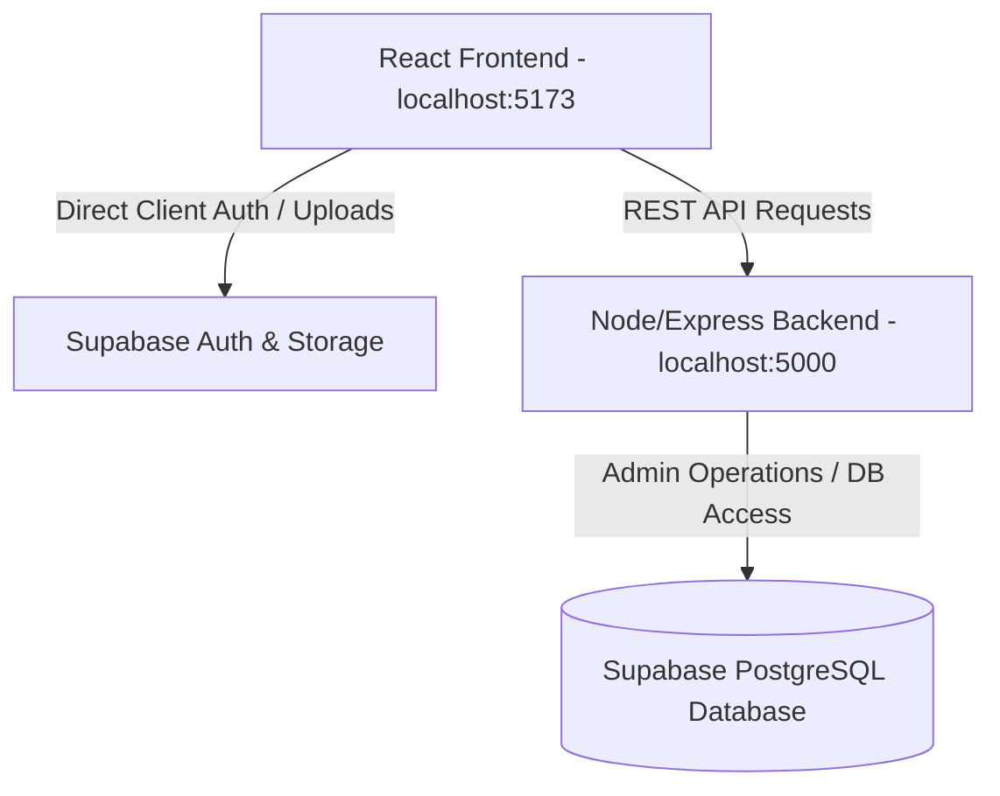
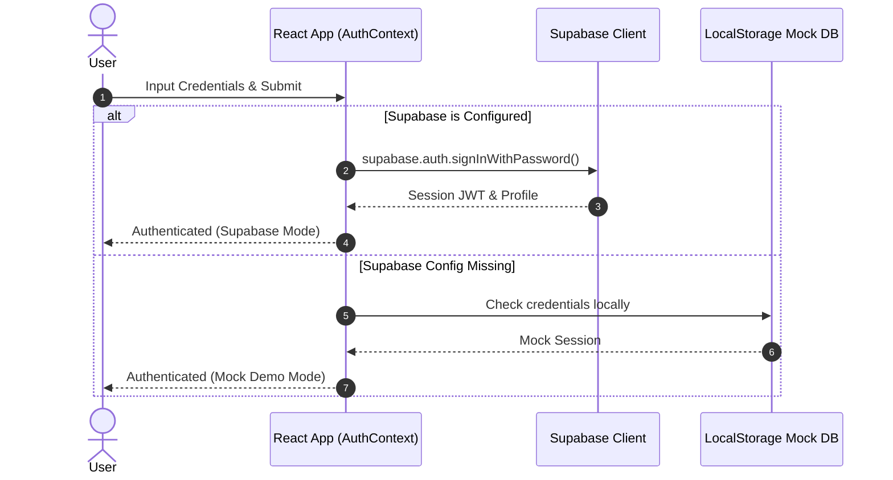
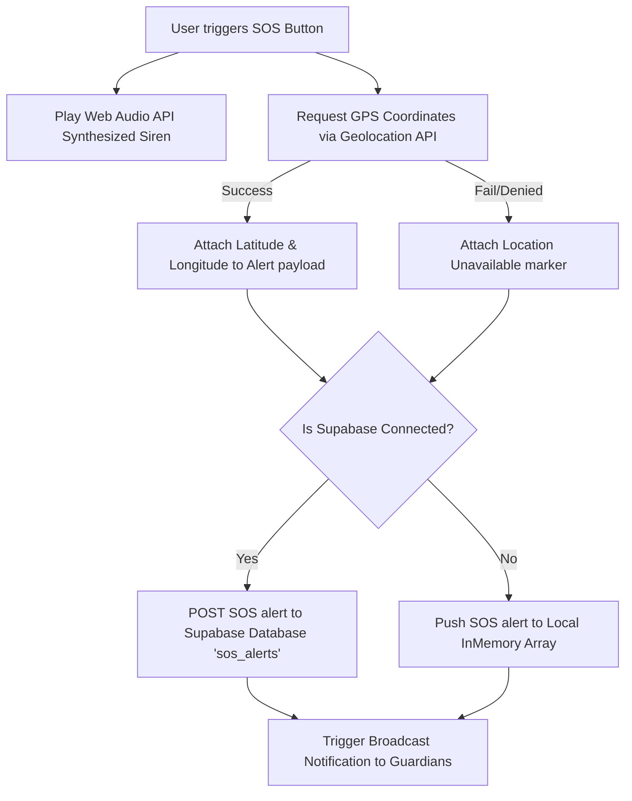
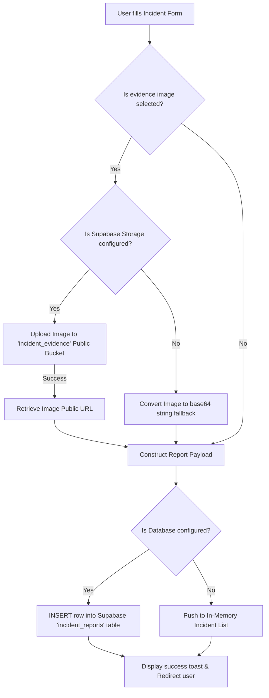

# SafeHer - Women Safety Full-Stack Application Blueprint

This document outlines the architectural blueprint, repository file structure, and core operational flows of the **SafeHer** full-stack women safety web application.

---

## 🏛️ System Architecture Overview

SafeHer is built as a highly responsive, secure, and resilient hybrid full-stack application:
- **Client Tier**: React (Vite) + Vanilla CSS/Tailwind CSS. Built with responsive viewport layouts for mobile-first usage. It interacts with Supabase Auth/Storage directly (for security and speed) and delegates API actions (contacts, SOS log management) to the custom backend server.
- **Backend Server Tier**: Node.js + Express. Exposes REST API endpoints and connects to Supabase via the Admin SDK (`service_role` key) to handle server-side validation and storage synchronization.
- **Backend-as-a-Service Tier**: Supabase (PostgreSQL database, Storage Buckets, and User Management Auth).



---

## 📂 File & Directory Structure

```
women-safety/
├── backend/                        # Node.js Express API Server
│   ├── .env                        # Private environment variables (DB/API credentials)
│   ├── package.json                # Server-side package metadata and dependencies
│   ├── server.js                   # Primary Express application & endpoint routes
│   └── setup.sql                   # SQL script to initialize DB tables & RLS policies
├── frontend/                       # Vite + React Client Application
│   ├── .env                        # Frontend client-side environment configurations
│   ├── index.html                  # HTML5 entry shell template
│   ├── package.json                # Client dependencies and execution scripts
│   ├── tailwind.config.js          # Tailwind CSS theme extension parameters
│   └── src/                        # Client-side React source code
│       ├── main.jsx                # Application entry mount point
│       ├── App.jsx                 # Routing shell and global context wrap
│       ├── index.css               # Global CSS styles, custom scrollbars, and keyframes
│       ├── config.js               # Global client runtime settings (e.g., Backend API URL)
│       ├── supabaseClient.js       # Supabase client initializer (Auth, Storage, DB client)
│       ├── components/             # Reusable UI component modules
│       │   ├── Common/             # Layout files (Navbar, Footer, SupportChat)
│       │   ├── Dashboard/          # Profile widgets (SavedReports, EmergencyHistory)
│       │   ├── Emergency/          # Core widgets (SOSButton, SafeMap radar)
│       │   └── Tips/               # Safety awareness widgets (TipCard)
│       ├── context/                # React State Context Providers
│       │   ├── AuthContext.jsx     # Controls global session state and auth methods
│       │   ├── LanguageContext.jsx # Handles English/Hindi localized translations
│       │   └── ThemeContext.jsx    # Handles Light/Dark mode state classes
│       ├── i18n/                   # Multi-language translation dictionaries
│       │   └── translations.js     # Text translation maps
│       └── pages/                  # Page-level route views
│           ├── Home.jsx            # Dynamic introductory dashboard landing page
│           ├── Emergency.jsx       # Instant SOS dashboard and live geolocation maps
│           ├── Dashboard.jsx       # User administrative control dashboard
│           ├── ReportIncident.jsx  # Harassment/incident filing and image upload desk
│           ├── SafetyTips.jsx      # Safe-navigation checklist and safety strategies
│           ├── PoliceHelplines.jsx # Fast-dial directory of regional help centers
│           └── LoginRegister.jsx   # Portal for registration & sign-ins
├── setup-supabase.js               # Local Node console utility to easily edit .env files
└── BLUEPRINT.md                    # System architecture & flowchart blueprint (This File)
```

---

## 🔄 Core Application Flows

Here are the functional flowcharts describing the step-by-step processes of the system.

### 1. User Authentication Flow
This diagram illustrates the login/registration sequence. If Supabase is unavailable or keys are missing, the system transparently falls back to LocalStorage Mock Auth, ensuring the app remains browsable offline.



---

### 2. Emergency SOS Alert Flow
The SOS flow leverages web APIs to ensure fast alerts. When triggered, the system plays a localized high-decibel audio siren and transmits coordinate payloads to the server database.



---

### 3. Incident Reporting Flow
Filing an incident report manages both unstructured text data and evidence media. Media files are sent to public object storage, and the resulting URL is stored in the database.



---

## 🔒 Row-Level Security (RLS) Policy Blueprint

To protect users' sensitive safety data, the database uses PostgreSQL RLS. Below is a blueprint of how access is regulated:

| Table | Policy Name | Operation | Logic/Permission | Description |
| :--- | :--- | :--- | :--- | :--- |
| **`trusted_contacts`** | `Users can manage their own trusted contacts` | `ALL` | `USING (true)` | Allows users to query and alter contacts. RLS can be further tightened to bind queries to `auth.uid()`. |
| **`sos_alerts`** | `Anyone can file an SOS alert` | `INSERT` | `WITH CHECK (true)` | Permits anonymous/non-registered visitors to report immediate emergencies. |
| **`sos_alerts`** | `Anyone can read SOS alerts` | `SELECT` | `USING (true)` | Enables incident visualization grids or administrative review. |
| **`incident_reports`** | `Anyone can file an incident report` | `INSERT` | `WITH CHECK (true)` | Supports anonymous logins or quick reports of safety hotspots. |
| **`incident_reports`** | `Anyone can read incident reports` | `SELECT` | `USING (true)` | Allows the community to see reported unsafe zones on maps. |
